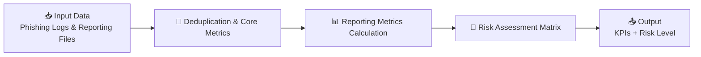

# Cyber Hackathon Project 🚀

## 👥 Team
- Ximena Prado Zegarra
- Namrata Dixit

## 🚀 Project Name: AutoPhish Reports

## 💡 Project Overview
This project delivers an AI-driven solution to automate phishing campaign reporting at Maersk. It replaces manual data processing from tools like Trend Vision One and Abnormal AI with an automated workflow that consolidates, calculates, and analyzes results. The solution also generates insights by identifying trends, enabling more targeted awareness and reducing human cyber risk.

## 🔐 Problem
Phishing campaign data is currently generated across multiple platforms, such as Trend Vision One and Abnormal AI, requiring manual extraction and calculation.
This process is time-consuming, prone to errors, and limits the ability to quickly identify trends, high-risk users, and recurring behaviours—reducing the effectiveness of cyber awareness efforts.

## ⚙️ Solution
This project introduces an AI-powered solution that automates the consolidation, calculation, and analysis of phishing campaign data.
It eliminates manual reporting while providing actionable insights, including trend analysis and detection of risky behaviours. This enables faster, data-driven decision-making and more targeted cyber awareness initiatives.

## 🛠️ Technologies
- **Dify** – used to design and orchestrate the end-to-end AI workflow  
- **Python (Code Nodes)** – implemented custom logic for data processing, calculations, and metrics (e.g., click/report rates)  
- **CSV / Excel** – input data source for phishing campaign results  
- **AI Automation** – to generate insights and streamline reporting  
- **GitHub** – for version control and collaboration 

## 📊 Impact
- Reduces manual reporting time by automating data consolidation and calculations  
- Improves accuracy by eliminating human error in report generation
- Enables targeted awareness by identifying high-risk audiences
- Accelerates decision-making with real-time, actionable insights
- Increases efficiency and scalability of reporting across multiple campaigns

## 🧩 End-to-End Pipeline

Each node is designed to progressively transform raw phishing telemetry into actionable risk insights, ensuring data accuracy, consistency, and executive-level visibility.

## ⚙️ Data Preprocessing & Core Metrics
The primary chunked streaming and action-priority filter logic is available in:
`./node1_deduplication.py`

It resolves cloud token limitations and handles:
- **Dynamic URL Resolution:** Deep-scans loose metadata objects to extract remote file streams.
- **Action Prioritization:** Keeps only the single highest-value interaction milestone per unique employee following the matrix rule: `Link Clicked > Mail Opened > Delivered > Bounced`.
- **Primary KPIs:** Extracts the overall audience baseline (`final_rows`), unique email clickers, and email opens directly from source memory.
- **Chunked Stream Packing:** Splits the resulting clean database into small bounded arrays to bypass platform character overhead ceilings.

## 📊 Reporting Metrics Calculation
The user compliance indicator engine is available in:
`./node2_reporting_metrics.py`

It parses the separate reporting telemetry and handles:
- **Reporter Identity Deduplication:** Isolates and creates unique signature maps of employees who reported the active security threat.
- **Dynamic Baseline Computation:** Receives the live target volume indicator straight from Node 1 to compute the global corporate **Reporting Rate** mapping.

## 🧠 Risk Assessment Matrix
The strategic multi-quadrant decision framework is available in:
`./node3_risk_matrix.py`

It cross-references live campaign ratios against adjustable target baselines to classify enterprise behaviors into specific postures:
- **🟢 Low Risk** *(High Report / Low Click)* – Users actively defend the boundary without interacting.
- **🟡 Medium Risk** *(High Click / High Report)* – Mixed behavior where training vectors are engaged but reported.
- **🔴 High Risk** *(High Click / Low Report)* – Critical posture failures with high compromise and low alerting.
- **⚪ Moderate Risk** *(Low Click / Low Report)* – Organizational apathy or low simulation interaction.

## 🎛️ Local Orchestration Engine
The pipeline orchestration simulator is available in:
`./main.py`

It maps the cloud runtime logic locally. It sequentially feeds inputs across all modules, handles type casting safety wrappers, and generates a structured telemetry payload ready for visual dashboards or security operational notification centers.

## 📤 Final Pipeline Outputs
The unified architecture returns a clean structured dataset ready to back reporting infrastructure:
- **Original & Cleaned Row Audits:** Complete trace metrics detailing duplicate entries purged.
- **Click & Open Rates:** True interaction ratios normalized around the processed sample volume.
- **Reporting Rate:** Dynamic company reporting score metrics.
- **Assigned Scenario & Risk Tier:** Evaluated organizational risk labels alongside descriptive remediation metadata.

## 🧠 Implementation Note

The solution was built using Dify workflows with Python code nodes.  
For demonstration purposes, the core logic has been modularized into standalone Python scripts.

## 🔮 Future Improvements

- 🧠 AI-powered risk prediction and behavioural modeling  
- 📊 Advanced dashboards with live insights  

