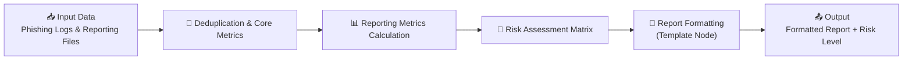

# Cyber AI Hackathon Project 🚀 - AutoPhish Reports

## 👥 Team
- Ximena Prado Zegarra
- Namrata Dixit

## 💡 Project Overview
This project delivers an AI-driven solution to automate phishing campaign reporting at Maersk. At present, data from platforms such as Trend Vision One and Abnormal AI is manually consolidated and calculated, requiring considerable time and resource investment while inherently carrying a risk of human error. 

The proposed solution introduces an automated workflow to streamline data processing, improving efficiency, consistency, and accuracy. In addition, it enables advanced analysis of phishing campaign data by identifying trends and patterns over time. These insights will support the Awareness team’s efforts to develop robust human risk metrics, allowing for more targeted, behaviour driven interventions to effectively reduce cyber risk across the organisation.

## 🔐 Problem
Phishing campaign data is currently distributed across multiple platforms, including Trend Vision One and Abnormal AI, necessitating manual extraction, consolidation, and calculation. This fragmented and labour-intensive approach requires significant time and dedicated resources from both CSOs and the Awareness team, diverting attention from higher priority operational responsibilities.

In addition to the inefficiencies, the reliance on manual processes introduces a heightened risk of inconsistencies and human error, impacting the reliability of reported outcomes. The absence of timely, automated insights limits the ability to generate immediate post campaign results, thereby delaying response and decision making.

Furthermore, the effort required to process raw data has restricted the systematic analysis of behavioural patterns and trends. As a result, the identification of high risk users, recurring vulnerabilities, and emerging risk indicators remains underdeveloped, reducing the overall effectiveness and maturity of cyber awareness and human risk management efforts.

## ⚙️ Solution
This project introduces an AI powered solution to address the critical inefficiencies and risks associated with current phishing campaign reporting. By automating the consolidation, calculation, and analysis of data across multiple platforms, it eliminates the dependency on manual processing and significantly reduces the time and resource burden on CSOs and the Awareness team. 

The solution enables near real time generation of accurate, consistent insights, supporting faster and more informed decision making. It also unlocks the potential ability to proactively identify trends, high risk behaviours, and vulnerable user groups that were previously overlooked due to operational constraints.

Importantly, this capability can be continuously evolved to deliver deeper intelligence—such as identifying emerging risk areas, regional risk patterns, and behavioural trends over time—thereby strengthening the organisation’s human risk metrics framework. This ensures a more proactive, data driven approach to cyber awareness, directly supporting the reduction of human cyber risk at scale.

## 🛠️ Technologies
- **Dify** – used to design and orchestrate the end-to-end AI workflow  
- **Python (Code Nodes)** – implemented custom logic for data processing, calculations, and metrics (e.g., click/report rates)  
- **CSV / Excel** – input data source for phishing campaign results  
- **AI Automation** – to generate insights and streamline reporting  
- **GitHub** – for version control and collaboration 

## 📊 Impact
- Reduces manual reporting time by automating data consolidation and calculations  
- Improves accuracy by eliminating human error in report generation
- Enables targeted awareness by identifying high-risk audiences
- Accelerates decision-making with real-time, actionable insights
- Increases efficiency and scalability of reporting across multiple campaigns

## 🧩 End-to-End Pipeline

## ⚙️ Data Preprocessing & Core Metrics
The primary chunked streaming and action-priority filter logic is available in:
`./node1_deduplication.py`

It resolves cloud token limitations and handles:
- **Dynamic URL Resolution:** Deep-scans loose metadata objects to extract remote file streams.
- **Action Prioritization:** Keeps only the single highest-value interaction milestone per unique employee following the matrix rule: `Link Clicked > Mail Opened > Delivered > Bounced`.
- **Primary KPIs:** Extracts the overall audience baseline (`final_rows`), unique email clickers, and email opens directly from source memory.
- **Chunked Stream Packing:** Splits the resulting clean database into small bounded arrays to bypass platform character overhead ceilings.

## 📊 Reporting Metrics Calculation
The user compliance indicator engine is available in:
`./node2_reporting_metrics.py`

It parses the separate reporting telemetry and handles:
- **Reporter Identity Deduplication:** Isolates and creates unique signature maps of employees who reported the active security threat.
- **Dynamic Baseline Computation:** Receives the live target volume indicator straight from Node 1 to compute the global corporate **Reporting Rate** mapping.

## 🧠 Risk Assessment Matrix
The strategic multi-quadrant decision framework is available in:
`./node3_risk_matrix.py`

It cross-references live campaign ratios against adjustable target baselines to classify enterprise behaviors into specific postures:
- **🟢 Low Risk** *(High Report / Low Click)* – Users actively defend the boundary without interacting.
- **🟡 Medium Risk** *(High Click / High Report)* – Mixed behavior where training vectors are engaged but reported.
- **🔴 High Risk** *(High Click / Low Report)* – Critical posture failures with high compromise and low alerting.
- **⚪ Moderate Risk** *(Low Click / Low Report)* – Organizational apathy or low simulation interaction.

## 🧾 Output Formatting (Template Node)
The user compliance indicator engine is available in:
`./node4_format_report.py`

To improve readability and usability, a Template Node was introduced before the final output. This node formats the calculated metrics into a clean, human-readable report.
Transforms raw metrics into an executive-friendly summary and ensures consistent formatting across outputs.

Makes results ready for:
- Reporting dashboards
- Leadership summaries
- Demo presentations

## 🎛️ Local Orchestration Engine
The pipeline orchestration simulator is available in:
`./main.py`

It maps the cloud runtime logic locally. It sequentially feeds inputs across all modules, handles type casting safety wrappers, and generates a structured telemetry payload ready for visual dashboards or security operational notification centers.

📤 Final Pipeline Outputs
The pipeline produces both structured data and a formatted report, enabling immediate use for analysis and decision-making:

📊 Core Metrics: Open Rate, Click Rate, Reporting Rate
🧹 Data Audit: Original vs. cleaned records and duplicates removed
🧠 Risk Insights: Scenario classification and risk level
📋 Formatted Report: Executive-ready summary via Template Node
  
## 🧠 Implementation Note

The solution was built using Dify workflows with Python code nodes.  
For demonstration purposes, the core logic has been modularized into standalone Python scripts.  
Additionally, any percentages shown are for demo purposes only; final benchmarks will be defined and calibrated in the production solution.

## 🔮 Future Improvements

- 🧠 AI-powered risk prediction and behavioural modeling  
- 📊 Advanced dashboards with live insights  

